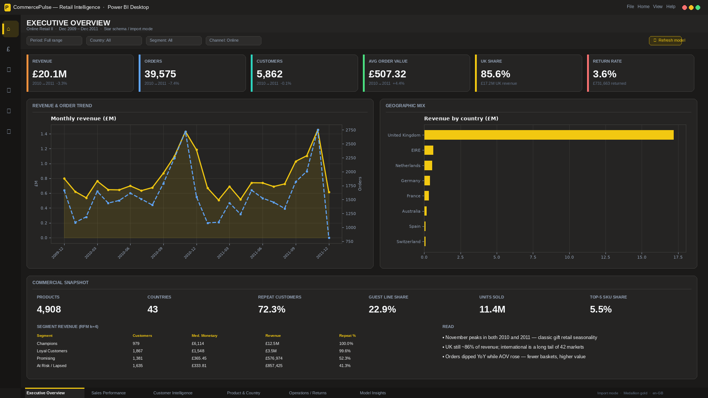
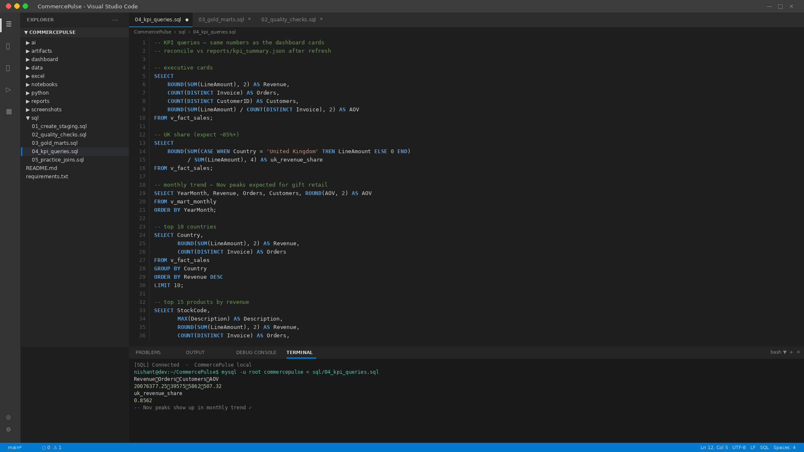
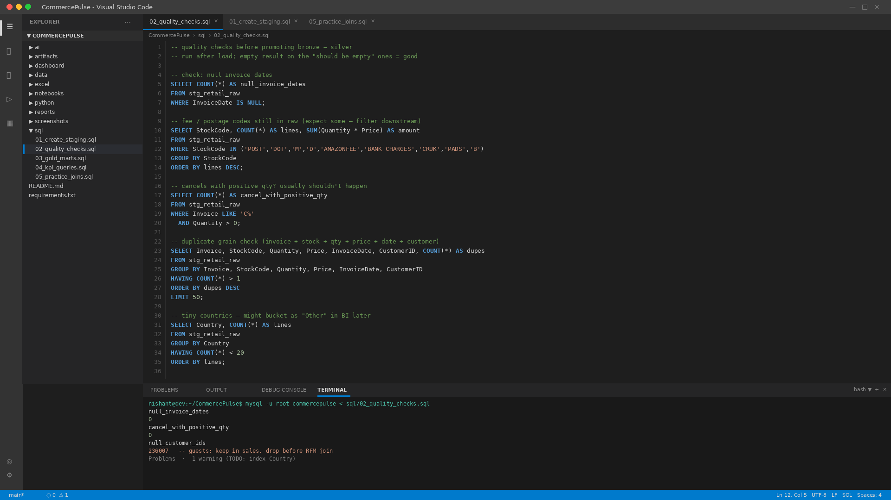
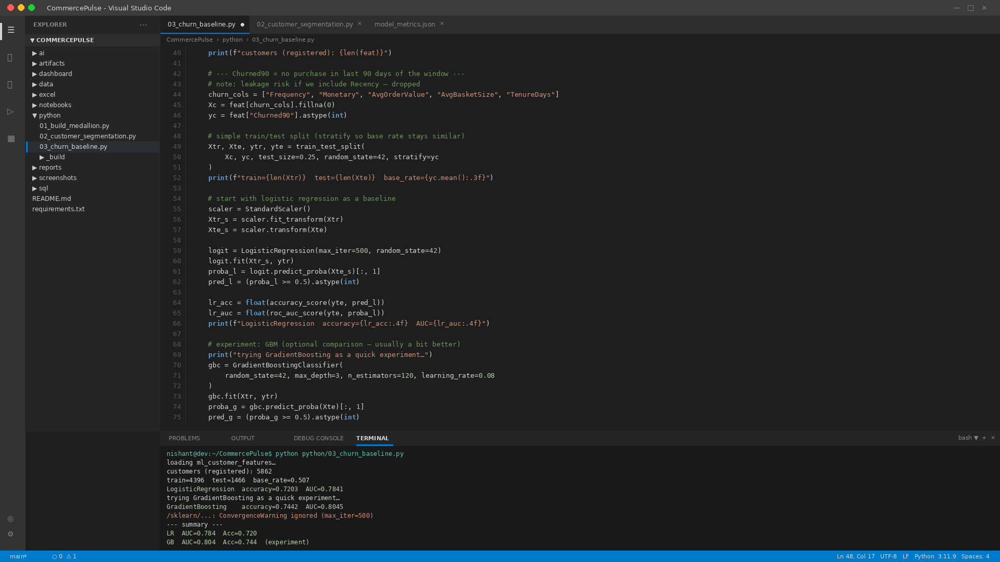
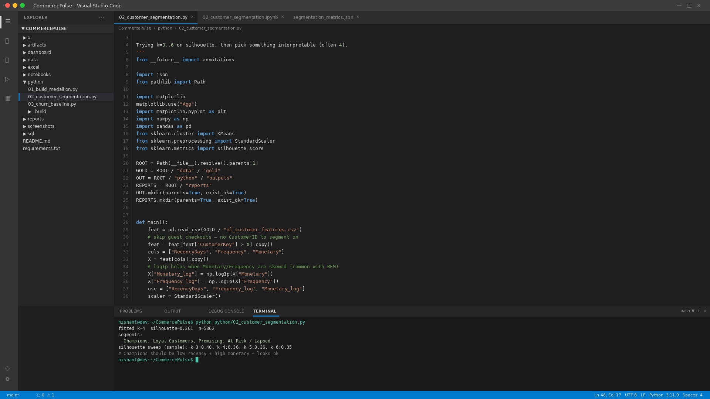

# CommercePulse

Retail intelligence platform on the UCI **Online Retail II** extract (UK online gift retailer, Dec 2009 – Dec 2011). End-to-end path from medallion data engineering through customer science (RFM, churn baseline), portfolio commercial report visuals wired to gold marts, and a local **TF-IDF** insights assistant over gold facts.

**GitHub:** [tnishant082-dev/CommercePulse](https://github.com/tnishant082-dev/CommercePulse)

**Semantic model stub:** [`dashboard/CommercePulse.pbip`](./dashboard/CommercePulse.pbip) (wired to `data/gold/*.csv`)

**Portfolio report visuals:** [`screenshots/`](./screenshots/) — numbers from gold / `reports/kpi_summary.json`

**Walkthrough:** [`artifacts/commercepulse-demo.mp4`](./artifacts/commercepulse-demo.mp4)

---

## Overview

CommercePulse is built for the question commercial leads actually ask: *how are we doing, where is it coming from, who should we worry about, and can the data team back that up?*

It is one repo covering:

| Layer | What you get |
|---|---|
| **Data Engineering** | Medallion folders (raw → bronze → silver → gold), SQL staging / quality / marts, Excel dictionary + cleaning log + reconciliation |
| **Data Science** | RFM k-means segments, churn propensity baseline, seasonal-naive demand baseline — metrics computed, limitations written down |
| **Data Analytics** | Six-page dark portfolio report visuals (charcoal + `#F2C811`), star schema stub, screenshots + silent demo |
| **AI Engineering** | Offline TF-IDF retrieval over gold facts + golden-question eval harness |

---

## Business problem

The source workbook is invoice-line grain across two overlapping year sheets. Useful for ops, painful for leadership.

- No single trusted view of **revenue, orders, customers, AOV, returns**
- Product / country performance buried in ~1M lines
- Guest checkouts, cancels, and fee codes mixed with merchandise sales
- No reusable customer features for retention work
- No lightweight way to ask the warehouse a plain-English follow-up without opening five files

---

## Architecture

```text
Online Retail II (UCI) ──► data/raw
        │
        ▼
   Bronze ── transactions (deduped, flagged)
        │
        ▼
   Silver ── sales_lines · returns · customers · products · invoices
        │
        ▼
   Gold   ── fact_sales / fact_returns + dims + ML features + marts
        │
        ├──► SQL KPI pack + Excel reconciliation
        ├──► RFM segments · churn / demand baselines
        ├──► Semantic model stub + portfolio report visuals
        └──► Insights assistant (TF-IDF retrieval over gold summaries)
```

---

## Workflow

1. **Ingest** both UCI year sheets → `data/raw/` (see `SOURCE.txt`)
2. **Bronze** normalize columns, flag cancels / fee codes, drop exact dupes — `python/01_build_medallion.py`
3. **Silver** apply revenue rules; separate returns; conform entities
4. **Gold** star schema + `ml_customer_features` + monthly / country / product marts
5. **Science** `python/02_customer_segmentation.py`, `python/03_churn_baseline.py`
6. **BI** review `screenshots/` or open the semantic model stub `dashboard/CommercePulse.pbip`
7. **Assistant** `python ai/rag/build_index.py` then `python ai/rag/retrieve.py "…"` or `streamlit run ai/app.py`

---

## Key metrics

Computed on the cleaned gold sales fact (fee codes out, cancels out, qty/price > 0). Figures match `reports/kpi_summary.json` and `sql/04_kpi_queries.sql`.

| KPI | Value | Note |
|---|---|---|
| Revenue | **£20.1M** | Full window Dec 2009 – Dec 2011 |
| Orders | **39,575** | Distinct invoices |
| Customers | **5,862** | Registered only |
| AOV | **£507.32** | Revenue / orders |
| UK share | **85.6%** | £17.2M |
| Return rate | **3.6%** | Return value / sales value |
| Repeat rate | **72.3%** | Customers with 2+ orders |
| Guest line share | **22.9%** | Null CustomerID lines |

Calendar **2010 → 2011** (honest YoY on overlapping months 1–12):

| | 2010 | 2011 | Δ |
|---|---|---|---|
| Revenue | £9.80M | £9.48M | **-3.3%** |
| Orders | 19,677 | 18,227 | **-7.4%** |
| Customers | 4,216 | 4,214 | **-0.05%** |
| AOV | £498 | £520 | **+4.4%** |

Orders dipped while AOV rose — fewer baskets, higher value. November still dominates both years.

### Model metrics (holdout / baseline)

| Model | Metric | Value |
|---|---|---|
| Churn LR baseline (Churned90) | AUC / Accuracy | **0.784 / 0.720** |
| Churn GBM (experiment) | AUC / Accuracy | **0.805 / 0.744** |
| Demand (seasonal naive lag-12) | MAPE | **17.3%** |
| AOV regressor | MAE | **£191** (naive £355) |
| RFM k-means (k=4) | Silhouette | **0.36** |

See `reports/model_metrics.json` for feature lists and written limitations. These are baselines, not production scorers.

---

## Dashboard pages

Report visuals below are **portfolio pages styled for review** (dark charcoal + gold `#F2C811`); **all KPI numbers come from `data/gold` / [`reports/kpi_summary.json`](./reports/kpi_summary.json)**. They are not Power BI Desktop exports or a live published workspace.

1. **Executive Overview** — KPI cards, monthly revenue/orders, country mix, segment snapshot
2. **Sales Performance** — 2010 vs 2011, monthly revenue & AOV, orders / units
3. **Customer Intelligence** — RFM segments, repeat / churn rates, segment economics
4. **Product & Country** — top SKUs and markets
5. **Operations / Returns** — return value trend, quality filters, guest-share note
6. **Model Insights** — AUC / MAPE cards with caveats on the same page

Screenshots live in [`screenshots/`](./screenshots/). The `.pbip` is a semantic model stub wired to gold; the PNGs are portfolio visuals for review.

---

## Insights

- **Seasonality:** clear November peaks in 2010 and 2011 — gift retail pattern, not noise
- **UK concentration:** ~86% of revenue; next markets (EIRE, NL, DE, FR) are a long tail
- **AOV vs volume:** YoY order decline with AOV lift is the commercial story, not a raw revenue collapse
- **Guests:** ~23% of sales lines lack CustomerID — fine for revenue KPIs, blocking for CRM / RFM until identity resolution
- **Champions segment:** small headcount, outsized revenue in the RFM cut — useful for retention prioritization drafts

---

## Business impact (capability)

What this repo demonstrates a hire can own:

- Stand up a **reconciled retail KPI layer** leadership can trust (Python ≡ SQL ≡ dashboard cards)
- Separate **merchandise revenue from fees / cancels / returns** without losing auditability
- Ship **customer segments + a defensible churn baseline** with leakage called out
- Deliver a **exec-ready multi-page report** and a **local insights assistant** that cites gold facts instead of inventing them

No fabricated £ savings claims — impact here is decision-quality and cycle time for commercial questions.

---

## Data model

Star schema on gold:

- `fact_sales` — invoice line grain (`SalesKey`, `DateKey`, `CustomerKey`, `ProductKey`, `CountryKey`, `LineAmount`, …)
- `fact_returns` — cancels + negative qty
- `dim_date`, `dim_customer`, `dim_product`, `dim_country`
- `ml_customer_features` / `customer_segments` — RFM + Churned90 + cluster labels
- Marts: `mart_monthly`, `mart_country`, `mart_top_products`

Semantic model stub relationships and DAX measures (`Revenue`, `Orders`, `Customers`, `AOV`, `Return Rate`, `UK Share`) are in `dashboard/CommercePulse.SemanticModel/`.

---

## Tools

Python 3 · pandas · scikit-learn · matplotlib · openpyxl · pyarrow · Streamlit · SQL (MySQL/ANSI) · semantic model stub (`.pbip` / TMDL) · ffmpeg (demo encode)

---

## Repo structure

```text
CommercePulse/
├── README.md
├── requirements.txt
├── artifacts/commercepulse-demo.mp4
├── ai/                  # insights assistant + eval
├── dashboard/           # CommercePulse.pbip stub + SemanticModel + Report
├── data/
│   ├── raw/             # SOURCE.txt + online_retail_II.xlsx
│   ├── bronze/
│   ├── silver/
│   └── gold/            # star schema CSVs for BI + ML features
├── excel/               # dictionary, cleaning log, reconciliation
├── notebooks/           # cleaning/EDA, segmentation, baselines
├── python/              # medallion + segmentation + churn scripts
├── reports/             # kpi_summary, model_metrics, segmentation_metrics
├── screenshots/         # portfolio report visuals + editor-framed SQL/ML shots
└── sql/                 # staging, quality, marts, KPIs, practice joins
```

---

## Screenshots

### Portfolio report pages

| Page | File |
|---|---|
| Executive Overview | [`screenshots/executive-overview.png`](./screenshots/executive-overview.png) |
| Sales Performance | [`screenshots/sales-performance.png`](./screenshots/sales-performance.png) |
| Customer Intelligence | [`screenshots/customer-intelligence.png`](./screenshots/customer-intelligence.png) |
| Product & Country | [`screenshots/product-country.png`](./screenshots/product-country.png) |
| Operations / Returns | [`screenshots/operations-returns.png`](./screenshots/operations-returns.png) |
| Model Insights | [`screenshots/model-insights.png`](./screenshots/model-insights.png) |



---

## SQL & ML engineering (editor-framed)

Editor-framed portfolio shots of SQL/Python in this repo (not a claim that these are raw IDE screen grabs from a production session):

| Shot | File |
|---|---|
| KPI SQL pack | [`screenshots/vscode-sql-kpi.png`](./screenshots/vscode-sql-kpi.png) |
| Quality checks | [`screenshots/vscode-sql-quality.png`](./screenshots/vscode-sql-quality.png) |
| Churn baseline | [`screenshots/vscode-ml-churn.png`](./screenshots/vscode-ml-churn.png) |
| RFM segmentation | [`screenshots/vscode-ml-segmentation.png`](./screenshots/vscode-ml-segmentation.png) |

### KPI SQL pack



### Quality checks



### Churn baseline



### RFM segmentation



**What I learned / checked along the way**

- Null `CustomerID`s are fine in sales facts (~23% guest lines) but have to be dropped before any RFM join — easy to forget.
- Recency would leak into `Churned90`, so the baseline uses Frequency / Monetary / Tenure instead; LR first, GBM only as a comparison.
- Silhouette liked k=3 a bit more, but k=4 was close enough and easier to label (Champions / Loyal / Promising / At Risk).
- `sql/05_practice_joins.sql` is where I drilled window functions (running revenue, country rank) against the same marts.

---

## How to run

```bash
# deps
pip install -r requirements.txt

# rebuild medallion + KPIs (needs data/raw/online_retail_II.xlsx)
python python/01_build_medallion.py
python python/02_customer_segmentation.py
python python/03_churn_baseline.py

# insights assistant
python ai/rag/build_index.py
python ai/rag/retrieve.py "Why did UK revenue change year over year?"
python ai/eval/run_eval.py
streamlit run ai/app.py
```

Optional: open `dashboard/CommercePulse.pbip` stub, confirm `pDataFolder` points at `data/gold`.

Source data: [UCI Online Retail II](https://archive.ics.uci.edu/dataset/502/online+retail+ii) (Chen, D., 2012). A local copy ships under `data/raw/` when size allows; otherwise follow `data/raw/SOURCE.txt`.

---

## Author

**Nishant Tyagi** — Data Analyst / Data Scientist / Data Engineer portfolio project.

GitHub: [tnishant082-dev](https://github.com/tnishant082-dev)
