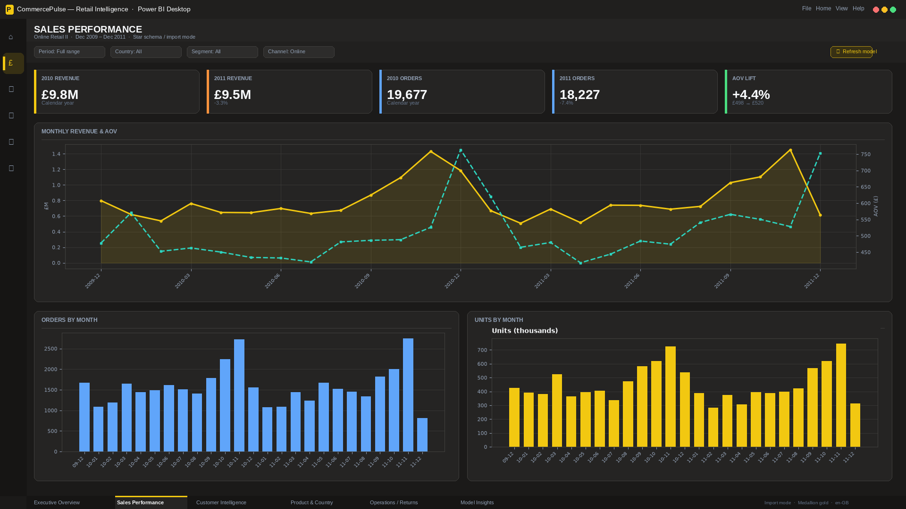
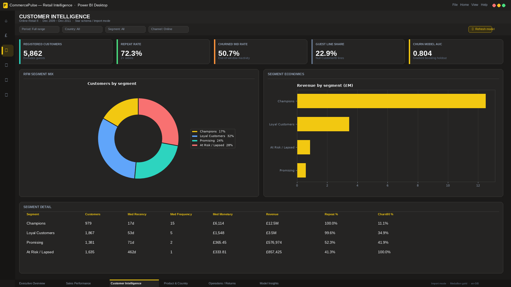
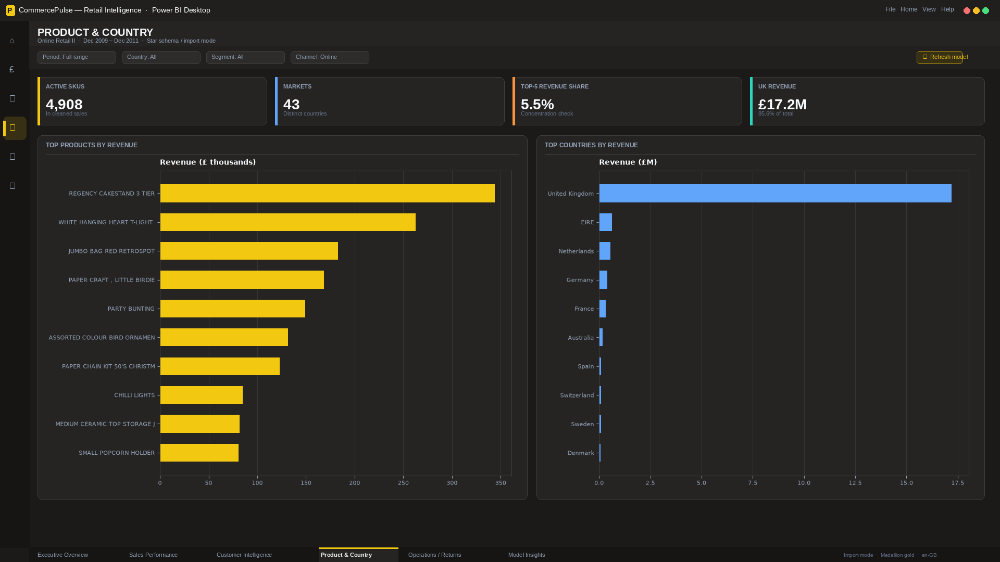
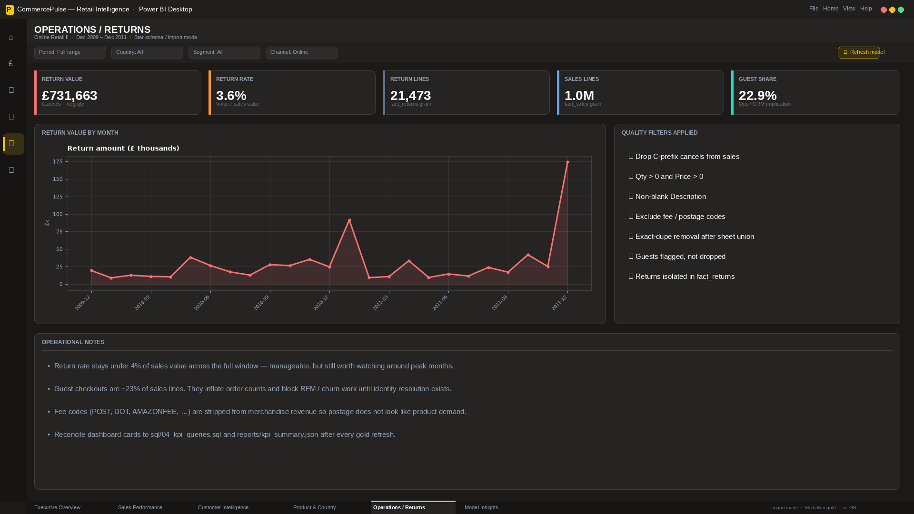
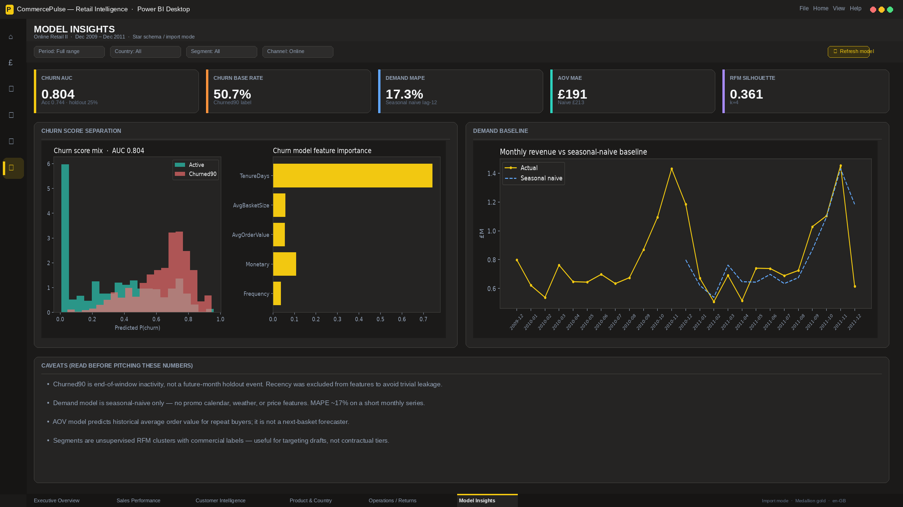

# CommercePulse

Retail analytics dashboard on the UCI Online Retail II extract (UK online gift retailer, Dec 2009 – Dec 2011). Revenue, orders, customers, returns, and market mix are reviewed together so commercial leads can see how the business is performing and where to dig next.

**Walkthrough:** [`artifacts/commercepulse-demo.mp4`](./artifacts/commercepulse-demo.mp4)

---

## Business Problem

Invoice-line extracts are useful for ops but hard for leadership. Without a shared view it is difficult to answer: *how are we doing, where is it coming from, and who should we worry about?*

Typical issues:

- No single trusted view of revenue, orders, customers, AOV, and returns
- Product and country performance buried in ~1M lines
- Guest checkouts, cancels, and fee codes mixed with merchandise sales
- No reusable customer segments for retention prioritization

---

## Dashboard Overview

A six-page interactive dashboard for commercial and ops review. Decision-makers can move from overall KPIs to sales trends, customer segments, product/country mix, returns, and high-level model insights in one place.

Period covered: **Dec 2009 – Dec 2011** · cleaned gold sales fact (fee codes and cancels out)

---

## Key Metrics

| KPI | Value |
|---|---|
| Revenue | **£20.1M** |
| Orders | **39,575** |
| Customers | **5,862** |
| AOV | **£507.32** |
| UK share | **85.6%** (£17.2M) |
| Return rate | **3.6%** |
| Repeat rate | **72.3%** |
| Guest line share | **22.9%** |

Calendar **2010 → 2011** (overlapping months 1–12):

| | 2010 | 2011 | Δ |
|---|---|---|---|
| Revenue | £9.80M | £9.48M | **-3.3%** |
| Orders | 19,677 | 18,227 | **-7.4%** |
| Customers | 4,216 | 4,214 | **-0.05%** |
| AOV | £498 | £520 | **+4.4%** |

Orders dipped while AOV rose — fewer baskets, higher value. November still dominates both years.

---

## Dashboard Pages

### Executive Overview


- Full-window revenue is **£20.1M** across **39,575** orders and **5,862** registered customers.
- AOV sits at **£507.32**; UK concentration is **85.6%** of revenue.
- Monthly trend and country mix set the commercial baseline before deeper drills.

### Sales Performance



- Overlap YoY revenue is **-3.3%** while AOV rises **+4.4%** — volume down, basket value up.
- Orders fall **-7.4%** (19,677 → 18,227) with customers essentially flat.
- November peaks in both years dominate the seasonal pattern.

### Customer Intelligence



- Repeat rate is **72.3%** among registered customers — loyalty is material.
- Guest lines are **~23%** of sales rows, so CRM views exclude them by design.
- RFM segments separate high-value Champions from At Risk groups for retention focus.

### Product & Country



- UK delivers **£17.2M** (**85.6%**); EIRE, Netherlands, Germany, and France form a long tail.
- Top products concentrate a meaningful share of orders; a small SKU set drives visibility.
- Country and product cuts help prioritize inventory and market conversations.

### Operations / Returns



- Return rate is **3.6%** of sales value (**£0.73M** return amount).
- Quality filters remove cancels and fee codes so merchandise KPIs stay clean.
- Guest-share note keeps revenue and CRM definitions honest side by side.

### Model Insights



- Customer segments and churn propensity highlight who is active vs at risk.
- Demand baseline (seasonal lag-12) frames monthly revenue movement at a high level.
- Useful for retention and planning discussions — not a substitute for commercial judgment.

---

## Key Findings

1. UK concentration (~86% of revenue) means export markets matter, but domestic performance drives the P&L.
2. YoY story is order decline with AOV lift — fewer baskets, higher value — not a raw revenue collapse.
3. November gift-retail peaks are structural in both 2010 and 2011.
4. Guests (~23% of lines) are fine for revenue KPIs but block CRM / RFM until identity is resolved.
5. Champions and At Risk segments give a practical starting list for retention work.

---

## Analysis Process

- Collected and cleaned the Online Retail II extract (cancels, fees, guests flagged).
- Validated revenue, orders, customers, AOV, and return definitions.
- Performed exploratory analysis on monthly, country, and product trends.
- Built RFM segments and high-level churn / demand views for Model Insights.
- Calculated business metrics used in the dashboard cards.
- Built dashboard pages to highlight commercial and ops bottlenecks.

---

## Tools Used

- Power BI
- SQL
- Python
- Excel

---

## Repository Structure

```text
data/          cleaned tables (csv / xlsx / parquet)
excel/         dictionary, cleaning log, summary
sql/           KPI and quality queries
notebooks/     analysis notebooks (.ipynb)
dashboard/     Power BI project (.pbip)
screenshots/   dashboard page images
artifacts/     walkthrough video
```

---

## How to View

1. Open `dashboard/CommercePulse.pbip` in Power BI Desktop
2. See [`screenshots/`](./screenshots/)
3. Watch [`artifacts/commercepulse-demo.mp4`](./artifacts/commercepulse-demo.mp4)

---

## Author

Nishant Tyagi
